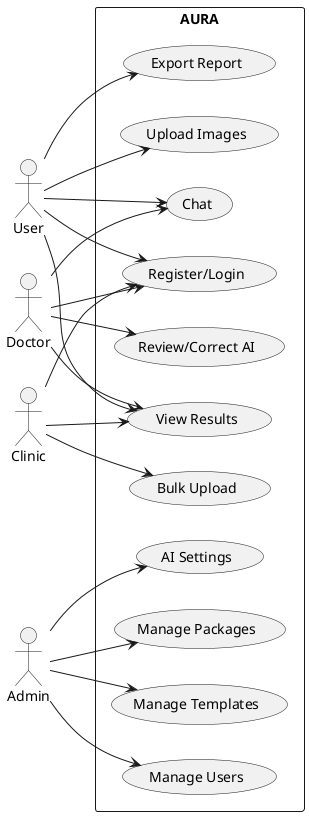
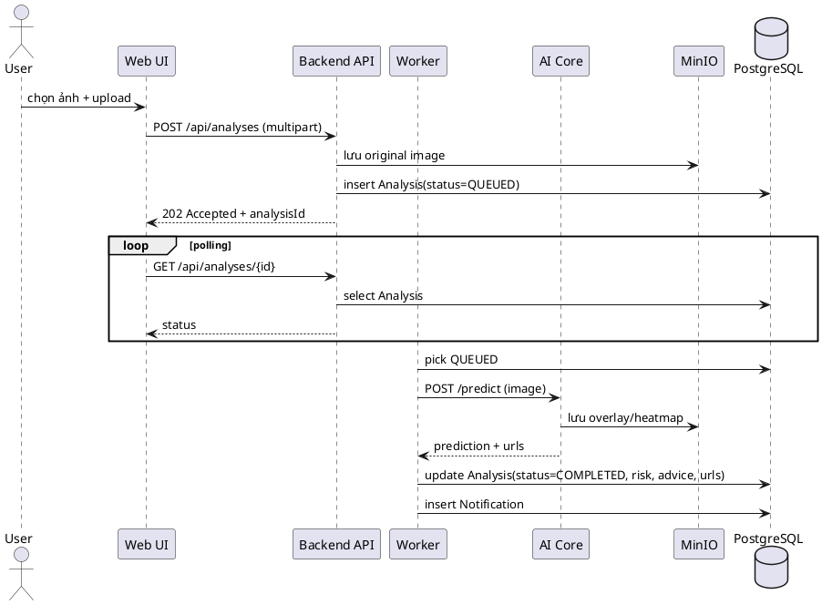
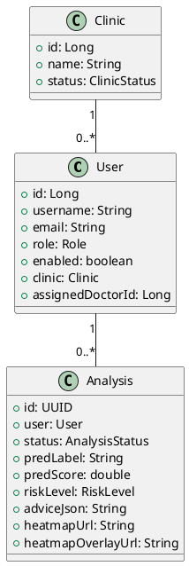

# Detail Design (UML 2.0)

Tài liệu này cung cấp **mã PlantUML** để bạn có thể render ra sơ đồ UML 2.0.

> Bạn có thể dùng PlantUML extension (VSCode) hoặc trang render PlantUML nội bộ.

## 1. Use Case Diagram (tóm tắt)

## 2. Sequence Diagram – Upload & Async Analysis

## 3. Class Diagram (rút gọn)

## 4. Notes
- UML chỉ mô tả cốt lõi; bạn có thể bổ sung các entity: Payment, Package, ChatMessage, Notification, Feedback...
